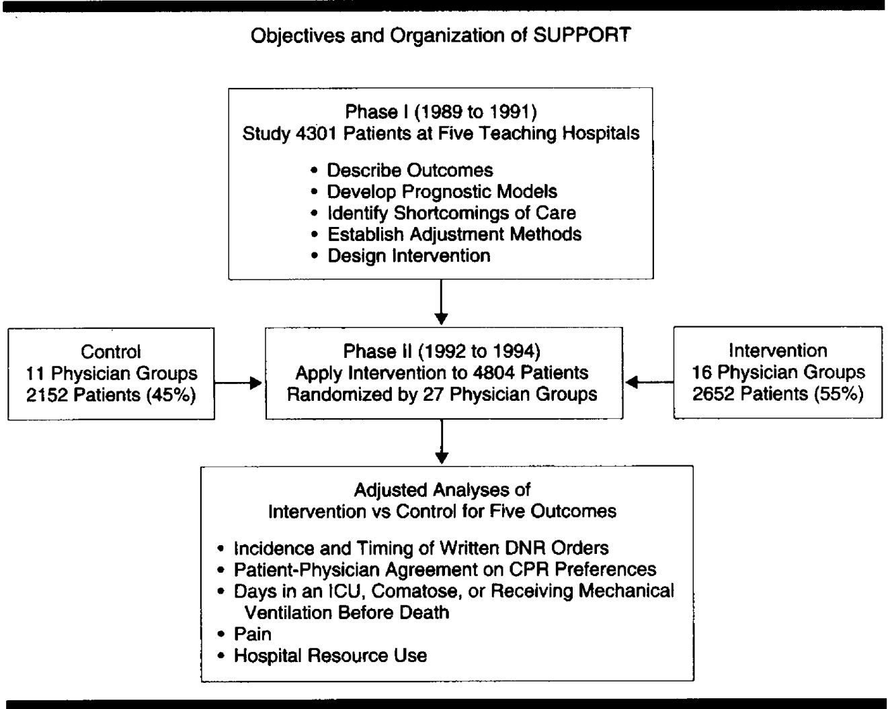

# Projects

# Introduction

This project looks to investigate and find key factors that exist in determining the different causes and factors that hint towards the existence of a specific disease. It is difficult to predict the existence of different disease based on one factor, therefore we attempted to predict them using multiple features available through machine learning techniques. This project will be accomplished by using the dataset SUPPORT2 in the UC Irvine Machine Learning Repository. This dataset comprises 9105 individual critically ill patients across 5 United States medical centers, accessioned throughout 1989-1991 and 1992-1994, as illustrated by [Figure 1](#figure-1-caption-describing-the-figure). Each row concerns hospitalized patient records who met the inclusion and exclusion criteria for eight disease categories: acute respiratory failure, chronic obstructive pulmonary disease, congestive heart failure, coma, colon cancer, lung cancer, multiple organ system failure with malignancy, and multiple organ system failure with sepsis. When predicting these diseases, we chose 21 features from this dateset, such as physiology score, chemical levels, and multiple measurements at Day 3, and [Table 1](images/table1.png) shows these feature names and descriptions. The Machine Learning algorithms logistic regression, neural networks, decision tree with XgBoosting and GradientBoosting, Support Vector Machine, and K-Nearest Neighbor are introduced, and we will see later on how our results perform on these diseases based on existing data.

## Figure 1: Caption describing the figure
[]

The rest of paper is organized as follows, Method Section will present the executed models in the order we explored. Results section will include the results from the methods listed above. Discussion section will present our interpretations, thought process, and criticism from beginning to end. Finally, Conclusion section will include our final thoughts.
