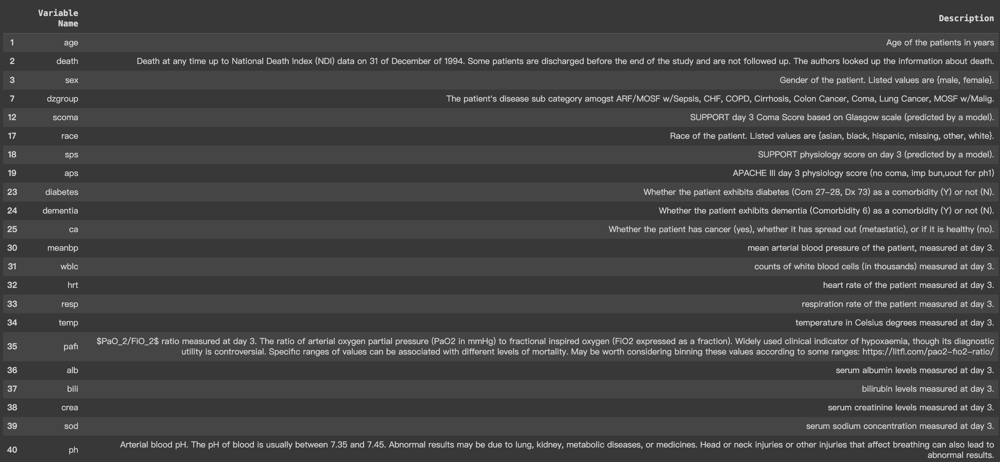

# Projects

# Introduction

This project aims to investigate and identify key factors that contribute to the diagnosis of specific diseases. Predicting the presence of various diseases based on a single factor is challenging; therefore, we have endeavored to predict them using multiple features available through machine learning techniques. This project will be carried out using the SUPPORT2 dataset from the UC Irvine Machine Learning Repository. This dataset comprises records of 9,105 critically ill patients from five United States medical centers, collected between 1989-1991 and 1992-1994, as illustrated by [Figure 1](#figure-1-support-project-phases). Each row contains the records of hospitalized patients who met the inclusion and exclusion criteria for one of eight disease categories: acute respiratory failure, chronic obstructive pulmonary disease, congestive heart failure, coma, colon cancer, lung cancer, multiple organ system failure with malignancy, and multiple organ system failure with sepsis. For disease prediction, we selected 21 features from this dataset, such as physiology scores, chemical levels, and various measurements on Day 3. [Table 1](#table-1-uci-dataset-features-detailed-information) presents the names and descriptions of these features. Machine Learning algorithms—logistic regression, neural networks, decision trees with XGBoost and Gradient Boosting, Support Vector Machines, and K-Nearest Neighbors—are employed, and we will later examine how our results fare in predicting these diseases based on the available data.

## Figure 1: SUPPORT Project Phases

*Figure 1.—Overall schematic presentation of phases I and II of the Study to Understand Prognoses and Preferences for Outcomes and Risks of Treatment (SUPPORT) project, 1989 to 1994. DNR indicates do not resuscitate; CPR, cardiopulmonary resuscitation; and ICU, intensive care unit.*

## Table 1: UCI Dataset Features Detailed Information

*Table 1.-UCI Dataset selected features descriptions.*

The rest of the paper is organized as follows: the Method Section will present the models we executed in the order we explored them. The Results Section will include findings from the aforementioned methods. The Discussion Section will present our interpretations, thought processes, and critiques from beginning to end. Finally, the Conclusion Section will offer our final thoughts.
